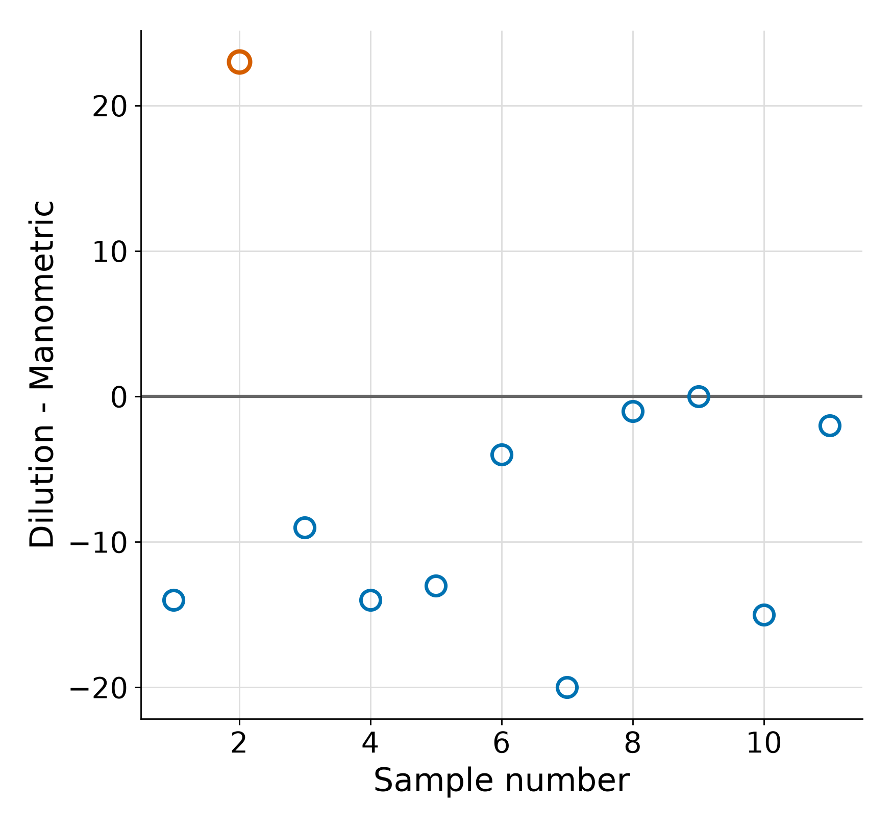
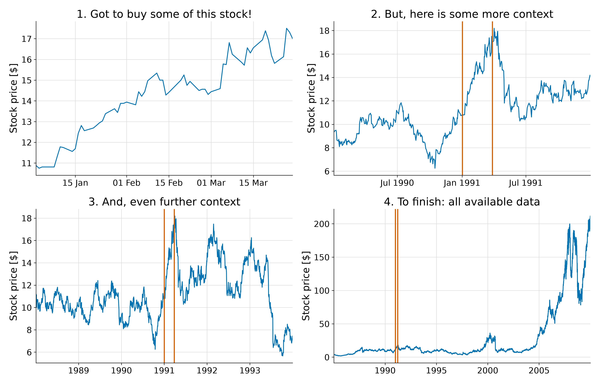
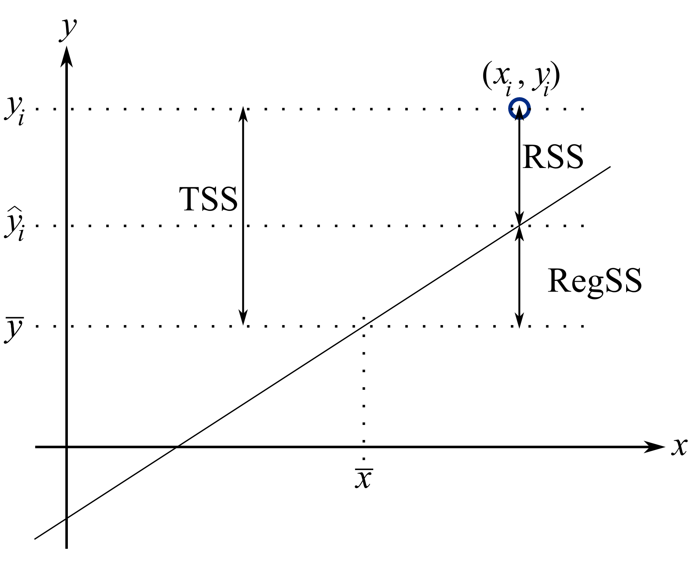
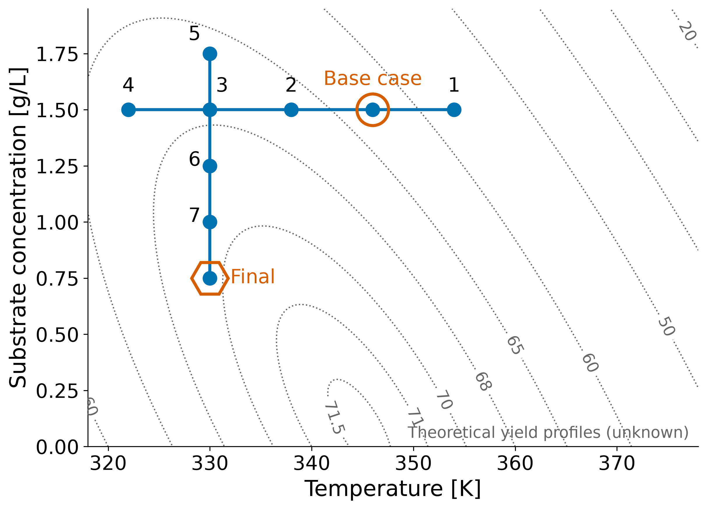
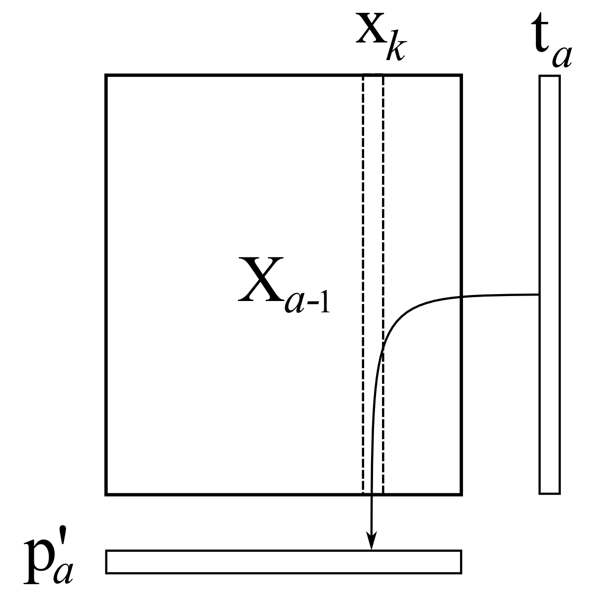
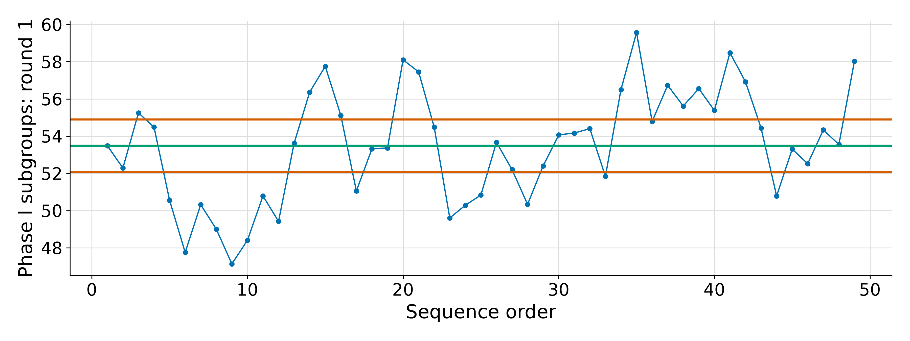
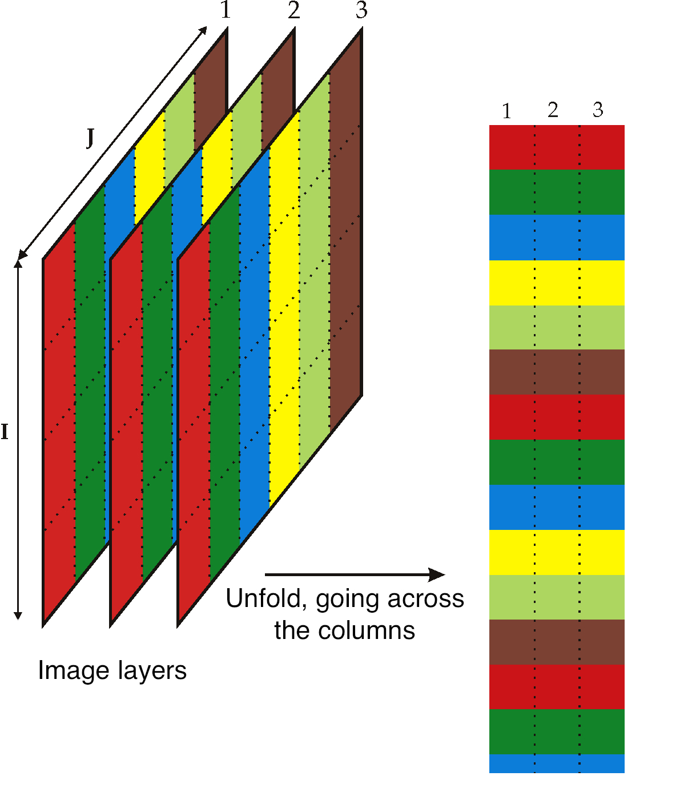

# Figures for *Process Improvement using Data*

This repository holds the figures used in the book
[**Process Improvement using Data**](https://learnche.org/pid) by Kevin Dunn, along
with the source scripts and editable artwork that produce them. It is a companion to the
book's text repository, [`kgdunn/pid-book`](https://github.com/kgdunn/pid-book), and to the
accompanying Python package, [`kgdunn/process-improve`](https://github.com/kgdunn/process-improve).

The figures live in their own repository, rather than inside the book, so that the same
image library can be shared across the book, slide decks, and other teaching material
without duplicating large binary files. The book checks this repository out as a symbolic
link named `figures/`, and its reStructuredText source then refers to images by paths such
as `figures/doe/COST-contours.png`.

## What is in here

Roughly 2000 rendered images (PNG, JPG, and SVG), together with the code and design files
that generate them:

- **Rendered output**: `.png`, `.jpg`, and `.svg` files. These are the images embedded in
  the book.
- **Generating scripts**: `.py` (matplotlib), `.R`, and `.m` (MATLAB) files that reproduce a
  plot from data. Where a figure is data-driven, its script sits next to it under the same
  name, for example `doe/COST-contours.py` produces `doe/COST-contours.png`.
- **Editable artwork**: `.svg` vector sources for hand-drawn diagrams, `.pxm` (Pixelmator)
  raster sources, and `.xmind` files for the mind maps.
- **Small supporting data**: a few `.csv` and `.dat` files used by the scripts.

## How the repository is organised

Files are grouped into topic folders, not one folder per book chapter. A single chapter
usually draws on several topic folders, and some folders (for example `doe/` and
`least-squares/`) also supply figures to other courses and talks. The main folders are:

| Folder | Contents |
| --- | --- |
| `univariate/` | Univariate statistics: distributions, confidence intervals, control-chart precursors |
| `visualization/` | Data visualization: time-series, scatter and bubble plots, tables |
| `least-squares/` | Least squares and regression: fits, residuals, leverage, ANOVA |
| `doe/` | Design and analysis of experiments: factorials, fractional factorials, response surfaces, optimal / DSD / OMARS designs |
| `pca/`, `pls/`, `multiblock/` | Latent-variable modelling: PCA, PLS, and multiblock methods |
| `batch/` | Batch process data analysis |
| `monitoring/`, `process-control/` | Process monitoring and control charts |
| `new-products/`, `image/`, `concepts/` | Product development, image analysis, and general concept diagrams |
| `examples/`, `teaching/`, `mindmaps/` | Worked examples, teaching aids, and chapter mind maps |

Other folders (`separations/`, `reactors/`, `econ-prob-solve/`, `classification/`, `svm/`,
and so on) support related teaching material and are not all used by the book.

### Naming

File names are descriptive and hyphenated, for example
`monitoring/CO2-phaseI-first-round.png`. When a figure has several variants, the variant is
appended to the stem, for example `doe/COST-contours.png` and
`doe/COST-contours-no-markers.png`.

## Where each book chapter's figures live

The table below lists the primary folder each chapter draws from, with one example figure
from that chapter.

### Univariate review

Primary folder: `univariate/`



### Data visualization

Primary folder: `visualization/`



### Least squares modelling

Primary folder: `least-squares/`



### Design and analysis of experiments

Primary folder: `doe/`



### Latent variable modelling

Primary folders: `pca/`, `pls/`, `multiblock/`



### Process monitoring

Primary folders: `monitoring/`, `process-control/`



### Product development using latent variables

Primary folders: `image/`, `new-products/`, `concepts/`



## Regenerating a figure

Data-driven figures are regenerated by running the script next to the image. For example:

```bash
cd doe
python COST-contours.py         # writes COST-contours.png
```

The book itself shows Plotly code to the reader, while the committed PNG is produced by the
matplotlib (or R, or MATLAB) script kept here. When the underlying analysis changes, update
the script and regenerate the image in the same commit, so the code and the picture stay in
step. Hand-drawn diagrams are edited in their `.svg` (or `.pxm`) source and re-exported.

## Usage rights

These figures are part of *Process Improvement using Data* and are licensed, like the book,
under the
[**Creative Commons Attribution-ShareAlike 4.0 International (CC BY-SA 4.0)**](https://creativecommons.org/licenses/by-sa/4.0/)
licence.

You are free to copy, adapt, and redistribute the figures, including for courses you teach
and for commercial use, provided that you:

- **give attribution** to the original author, Kevin Dunn, and
- **share alike**, licensing any adapted version under the same CC BY-SA 4.0 terms.

A small number of figures adapt third-party material (for example screenshots, or plots of
publicly reported data such as stock prices). Where that is the case, the book credits the
original source at the point of use; please carry that credit through if you reuse such a
figure.

## Citation

If you use these figures, please cite the book:

> Dunn, K. G. (2010–2026). *Process Improvement using Data* (CC BY-SA 4.0). Zenodo.
> https://doi.org/10.5281/zenodo.20284934

- Book: <https://learnche.org/pid>
- Book source: <https://github.com/kgdunn/pid-book>
- Companion package: <https://github.com/kgdunn/process-improve>
